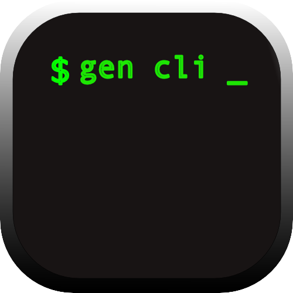

    
**Gen-CLI** is a Python-based command-line tool for generating boilerplate code and framework templates for multiple programming languages.

## Features

- Single-file boilerplate generation for multiple languages
- Project scaffolding using framework templates
- Colorful directory tree visualization
- Environment diagnostics with `gen doctor`
- Dry-run mode for previewing outputs
- Overwrite support for existing files/directories

---

## Installation

### From Source

```bash
git clone https://github.com/prasadrajug/gen-cli.git
cd gen-cli

# Install for usage
pip install -e .

# Install for development (includes tests, linting tools)
pip install -e .[dev]
```

### Using uv

```bash
uv sync
```

### Verify Installation

```bash
gen --version
```

---

## Quick Start

```bash
# Generate a C boilerplate file
gen c

# Generate a Python boilerplate file
gen py

# Generate a Flask project
gen flask

# List available languages and frameworks
gen list

# Show directory tree
gen tree

# Check your environment
gen doctor
```

---

## Commands

### `gen --version` / `gen -v`

Show the installed version of gen-cli.

```bash
gen --version
gen -v
```

Output: `gen-cli version 1.0.0`

---

### `gen --help` / `gen -h`

Show the help message with all available commands and options.

```bash
gen --help
gen -h
```

---

### `gen list`

List all available language templates and framework templates.

```bash
gen list
```

Output:
```
Available Languages
-------------------
  • .py
  • .c
  • .cpp
  • .go
  • .js
  • .rs
  • .html
  • .java

Available Frameworks
--------------------
  • flask
  • codeforces
```

---

### `gen doctor`

Check your environment and configuration for potential issues.

```bash
gen doctor
```

Output:
```
Gen CLI Doctor
----------------------------------------
✓ Python Version: 3.13.12
✓ Platform: Darwin 24.0.0
✓ Working Directory: /Users/user/project
✓ PATH directories: 17 found

All checks passed
```

---

### `gen tree`

Display a colorful tree view of your directory structure.

```bash
gen tree                    # current directory, depth 2, no hidden
gen tree -a                 # include hidden files/dirs
gen tree -3                 # depth of 3 levels
gen tree -3 src             # depth 3 of specific directory
gen tree -2 -a .            # depth 2, include hidden, current dir
```

**Tree options:**

| Flag | Description |
|------|-------------|
| `-N` | Set depth (e.g., `-2`, `-3`) |
| `-a`, `--all` | Include hidden files/dirs |

**Colors:**

- **Bold blue** — directories
- **Green** — regular files
- **Dim/gray** — hidden files and connectors

---

### Language Generation

Generate a boilerplate file for a specific language.

```bash
gen c           # creates main.c
gen py          # creates main.py
gen js          # creates main.js
gen go          # creates main.go
gen rs          # creates main.rs
gen cpp         # creates main.cpp
gen java        # creates main.java
gen html        # creates main.html
```

**Options:**

| Flag | Description |
|------|-------------|
| `--dryrun` | Preview the file content without creating it |
| `--overwrite` | Overwrite existing file |

**Examples:**

```bash
gen c --dryrun              # preview main.c content
gen py --overwrite          # overwrite main.py if exists
gen js --dryrun --overwrite # dry run (overwrite ignored)
```

**When file already exists:**

```bash
gen c
main.c already exists
Use --overwrite to replace: gen c --overwrite
```

---

### Framework Generation

Generate a full project from a framework template.

```bash
gen flask                   # prompts for project name
gen flask myapp             # creates myapp/ directly
gen codeforces              # prompts for project name
gen codeforces solutions    # creates solutions/ directly
```

**Options:**

| Flag | Description |
|------|-------------|
| `--dryrun` | Preview project structure without creating |
| `--overwrite` | Remove existing directory and regenerate |

**Examples:**

```bash
gen flask --dryrun          # preview flask project tree
gen flask myapp --dryrun    # preview tree for 'myapp'
gen flask myapp --overwrite # overwrite myapp/ if exists
```

**When directory already exists:**

```bash
gen flask myapp
Directory 'myapp' already exists
Use --overwrite to replace: gen flask myapp --overwrite
```

---

## Supported Languages

| Command | Output File |
|---------|-------------|
| `gen c` | `main.c` |
| `gen py` | `main.py` |
| `gen js` | `main.js` |
| `gen go` | `main.go` |
| `gen rs` | `main.rs` |
| `gen cpp` | `main.cpp` |
| `gen java` | `main.java` |
| `gen html` | `main.html` |

## Supported Frameworks

| Command | Description |
|---------|-------------|
| `gen flask` | Flask web application |
| `gen codeforces` | Codeforces competitive programming setup |

---

## Error Handling

Gen-CLI provides clear error messages for common issues:

```bash
# Unknown command
gen xyz
→ Unknown command: xyz
  Usage: gen [list|doctor|tree|<lang>|<framework>] [-v|--version] [-h|--help]

# Unknown flag
gen c --invalid
→ Unknown flag: --invalid
  Usage: gen [list|doctor|<lang>|<framework>] [-v|--version] [-h|--help]

# Invalid tree depth format
gen tree 3
→ Invalid depth format: '3'
  Use '-' prefix for depth, e.g., 'gen tree -3' or 'gen tree -3 src'

# Path not found
gen tree nonexistent
→ Path not found: nonexistent
```

---

## Development

### Setup

```bash
uv sync --all-extras
```

### Running Tests

```bash
# Run all tests
uv run pytest tests -v

# Run specific test file
uv run pytest tests/test_cli.py -v
```

### Running from Source

```bash
uv run gen <command>
```

---

## Project Structure

```
gen-cli/
├── src/
│   └── gen/
│       ├── __init__.py
│       ├── cli.py              # Main CLI entry point
│       ├── paths.py            # Template path resolution
│       ├── commands/
│       │   ├── __init__.py
│       │   ├── doctor.py       # Environment diagnostics
│       │   ├── helper.py       # Help messages
│       │   ├── list_.py        # Template listing & tree view
│       │   └── template.py     # Template generation helpers
│       ├── core/
│       │   ├── __init__.py
│       │   └── render.py       # Jinja2 template rendering
│       └── templates/          # Built-in templates
│           ├── lang/           # Language boilerplate files
│           └── frameworks/     # Framework project templates
├── tests/
│   └── test_*.py               # Unit tests
├── pyproject.toml
└── README.md
```

---

## License

MIT License

---

## Author

Prasad Raju G
